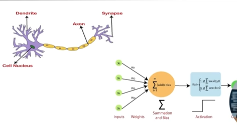

 
<b>Bismillah-hi-Rahman-i-Raheem.</b>
 
<small>Starting with the name of Allah</small>

# Deep Learning
Deep learning is all about computers learn data and make sense of it all on its own without explicitly programming for that.

## What is Deep learning
- Deep learning is collection of statistical techniques of machine learning for learning feature hierarchies that are actually based on artificial neural networks.
- has Artificial neural networks
- Subset of Machine Learning

### Algo VS Neural Networks
- Algo = Set of formulas
- NN = Connections

Whole Tree:
1. AI 
2. ML (all about algorithms)
3. Deep Learning (all about neural networks)
and all of it has data science.'

### Differences
- Machine Learning:
    - Perform well on small or medium dataset
    - works on low end machines
    - understand the features and how they represent the data
    - training time = short
    - processing time can be few seconds or hours
    - no of algorithms is many
    - data interpretation: some ML algorithms are easy to interpret, whereas some are hardly possible.
    1. Supervised
          - Classification
          - Regression
    2. Unsupervised
          - Clustering
          - Association

- Deep Learning:
    - Perform well on big data
    - Requires more hardware capabilities
    - need to understand the basic functionality of the data
    - training time = long
    - processing time can be few hours or weeks
    - no of algorithms is few
    - data interpretation can sometimes be difficult
    1. contains supervised learning (Clf, Reg)

## Neurons, Neural networks

### Neurons: 
Artificial neurons are similar to human neurons.
1. Single layer perceptron (Single neuron)
2. Multi layer perceptron

**Neuron**
- Takes inputs → Send signals
    - Dendrites ↔ Inputs 
    - Cell Body ↔ Summation and Bias
    - Axon      ↔ Activation function
    - Synapse   ↔ Output

### Neural Networks
Multiple neural layers & connections

**Types of deep learning networks:**
1. Perceptron (single neuron)
2. Feed Forward Networks (same as 1)
3. Multi layer perceptron (ANN)
4. Radial Based Networks
5. Convolution Neural Networks (best for images)
6. Recurrent Neural Networks (best for text related works)
7. Long Short-Term Memory Networks

## Applications
- Voice Recognition
- Object Detection
- Self driving cars
- Translators

## Single Layer Perceptron
- also called single neural network or base neural networks.
- ANN, CNN etc made from signal layer perceptron.
- summation & bias formulas is same as y = mx + c. where m = w & c = b.
- (Activation function): make the number from [summation & bias] in desire output.  Eg: 0.0423 = 0 class
- if output is still not what we want then we use back propagation.
- Propagation: Changing values of weight-age & bias.
- X1 ↘
- X2 → [Summation & Bias] ↦ (Activation) → Output
- X3 ↗

**Note :**
- this type of neural network is not used nowadays much due to modern day complex data.
- but it is the base of all other neural networks.

**Formula :**
$$y = w^Tx + b$$
- wt & x are matrices which multiplied with each other
- and b is add

### Perceptron work or Neuron work
- works only on linear separable data.
After this lets move to [Jupyter Notebook](main.ipynb)

### Topics in Notebook: 
1. Perceptron work or Neuron work
2. Multi-layer perceptron & Notation (ANN)